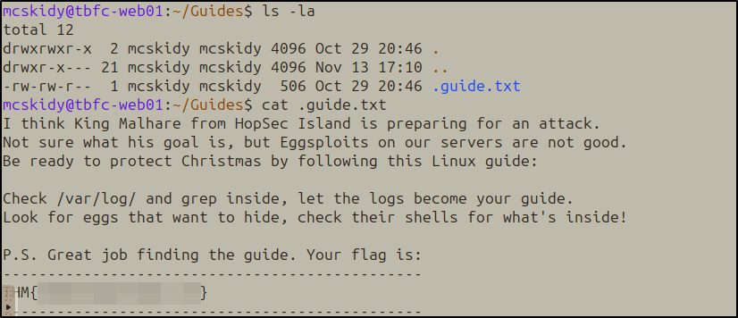
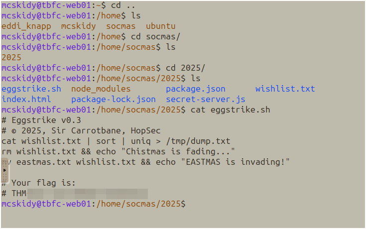
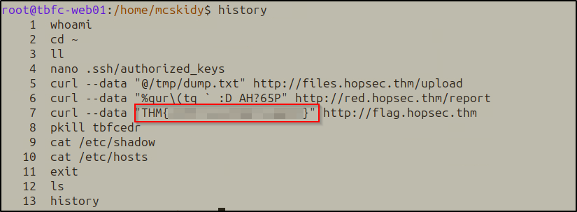
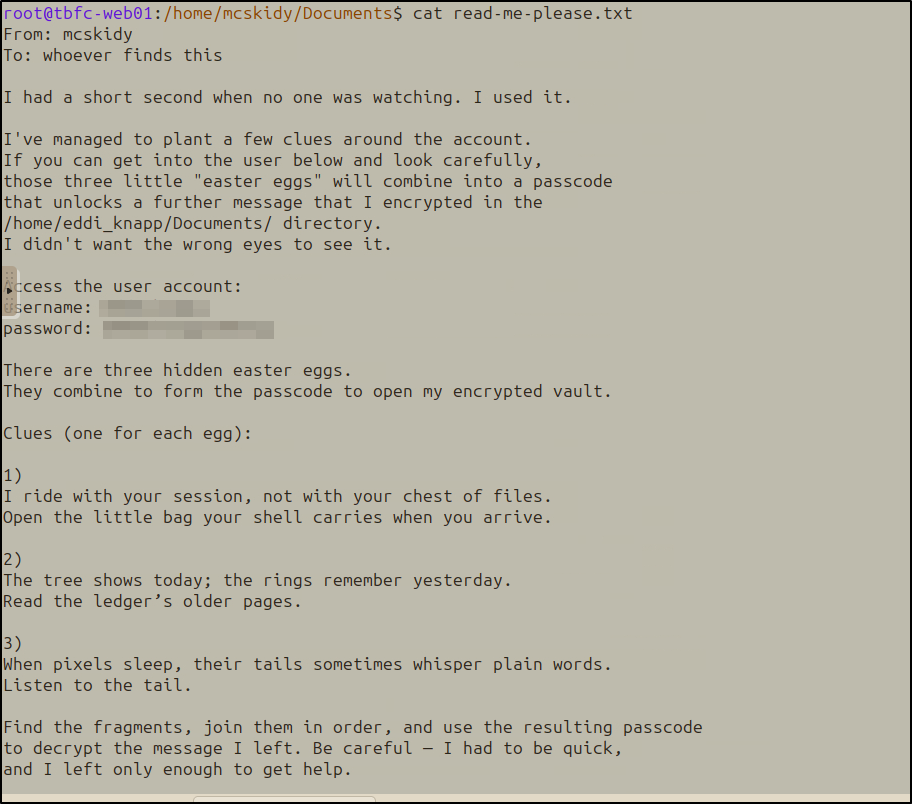
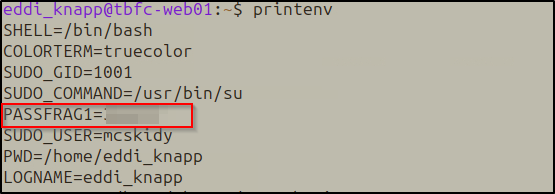
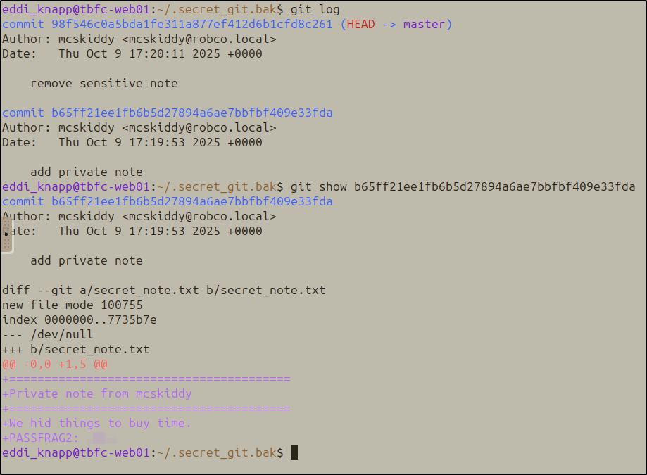
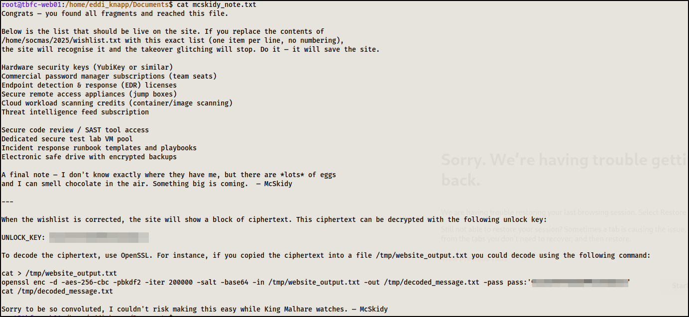
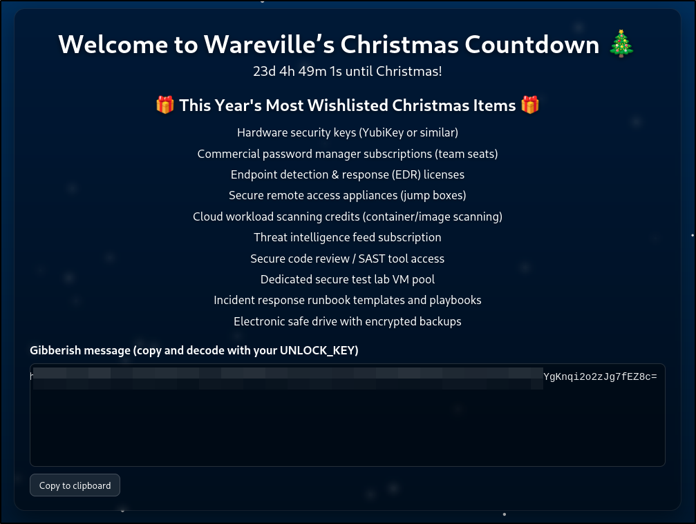
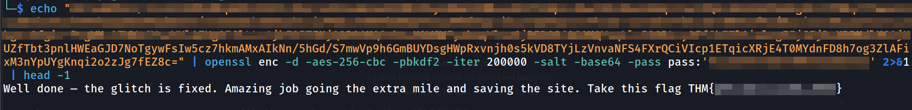

# Day 1 - Linux CLI - Shells Bells

## Challenge Overview

McSkidy has been kidnapped, and Wareville's defenses are compromised. The investigation starts on **tbfc-web01**, a Linux server processing Christmas wishlists. Somewhere within its data may lie the truth: traces of McSkidy's final actions, or perhaps the clues to King Malhare's twisted vision for EASTMAS.


### Task 1: Which CLI command would you use to list a directory?

**Answer:** `ls`

Standard directory listing command.

### Task 2: What flag did you see inside of McSkidy's guide?

Started by listing directory contents with `ls -la` to reveal hidden files:



Found the hidden `.guide.txt` file and read it:

```bash
cat .guide.txt
```

The guide contained a warning about King Malhare and instructions to check logs and shell configurations.
### Task 3: Which command helped you filter the logs for failed logins?

**Answer:** `grep`

### Task 4: What flag did you see inside the Eggstrike script?

Navigated to the socmas directory structure:

```bash
cd /home/socmas/2025/
cat eggstrike.sh
```

The script showed Sir Carrotbane's sabotage attempt to replace the Christmas wishlist with EASTMAS propaganda.



### Task 5: Which command would you run to switch to the root user?

**Answer:** `sudo su`

### Task 6: Finally, what flag did Sir Carrotbane leave in the root bash history?

After switching to root, checked command history:

```bash
history
```



## Side Quest 1!

The `/home/mcskidy/Documents/read-me-please.txt` revealed a puzzle involving three "easter eggs" that combine into a decryption passphrase.



### Easter Egg 1: Environment Variables

**Riddle:** "I ride with your session, not with your chest of files. Open the little bag your shell carries when you arrive."

```bash
printenv
```



### Easter Egg 2: Git History

**Riddle:** "The tree shows today; the rings remember yesterday. Read the ledger's older pages."

Located a backup git repository in the home directory:

```bash
cd ~/.secret_git.bak
git log
```

Examined an older commit that added a private note:

```bash
git show b65ff21ee1fb6b5d27894a6ae7bbfbf409e33fda
```



### Easter Egg 3: Steganography

**Riddle:** "When pixels sleep, their tails sometimes whisper plain words. Listen to the tail."

Listed files in `/home/eddi_knapp/Pictures/`:

```bash
ls -la /home/eddi_knapp/Pictures/
```

```bash
strings /home/eddi_knapp/Pictures/.easter_egg
```


### Decryption

Combined the three fragments to decrypt McSkidy's GPG-encrypted note:

```bash
gpg -d mcskidy_note.txt.gpg > mcskidy_note.txt
cat mcskidy_note.txt
```



The decrypted note revealed instructions about a corrupted wishlist on the website (port 8080). It included a specific list of security tools that needed to be in the wishlist file.

After correcting the wishlist, accessed the website on port 8080. The site displayed a "gibberish message" section with a long base64-encoded ciphertext and instructions to decode it with the UNLOCK_KEY.



### Breaking the Cipher

Used OpenSSL with AES-256-CBC to decrypt:

```bash
echo "[LONG_BASE64_CIPHERTEXT]" | openssl enc -d -aes-256-cbc -pbkdf2 -iter 200000 -salt -base64 -pass pass:'[UNLOCK_KEY]' | head -1
```



## Thanks for Reading!

If you made it this far, thanks for sticking with me on this journey!

**Questions? Comments? Want to tell me I'm doing it wrong?**  
Feel free to reach out! I'm always learning and happy to discuss security stuff.

**Want to try this yourself?**  
https://tryhackme.com/room/linuxcli-aoc2025-o1fpqkvxti
