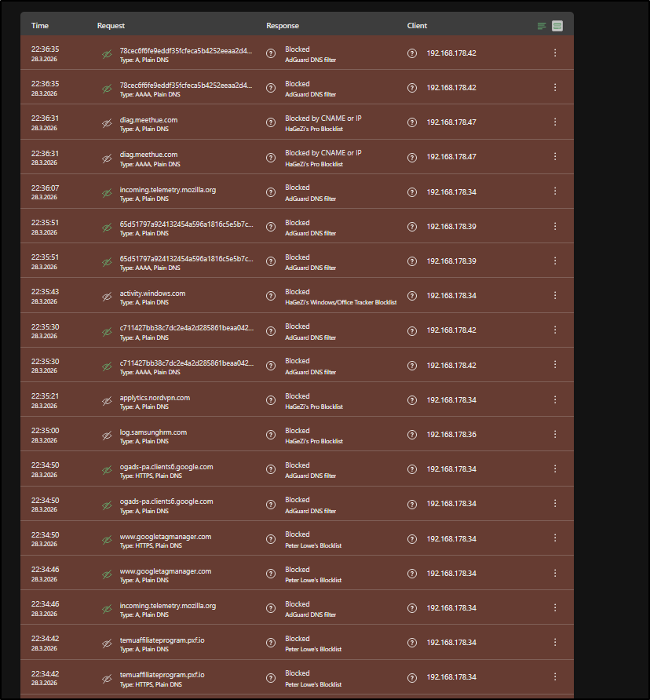
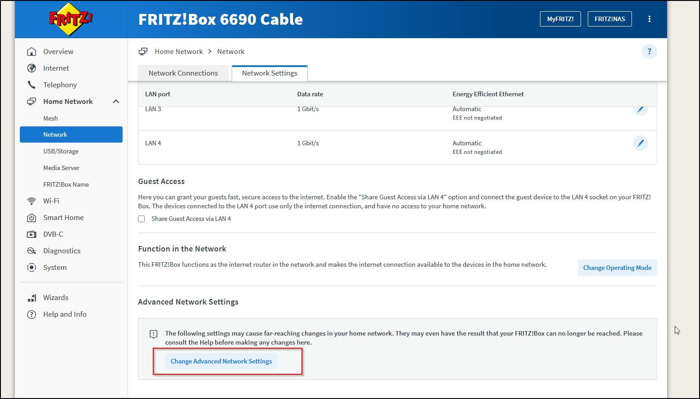
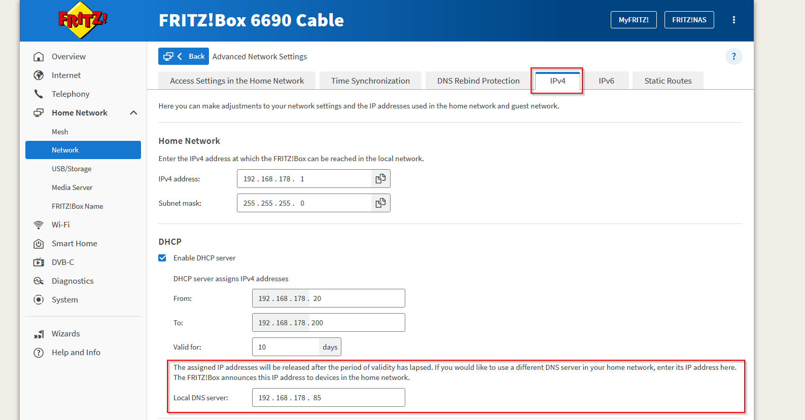
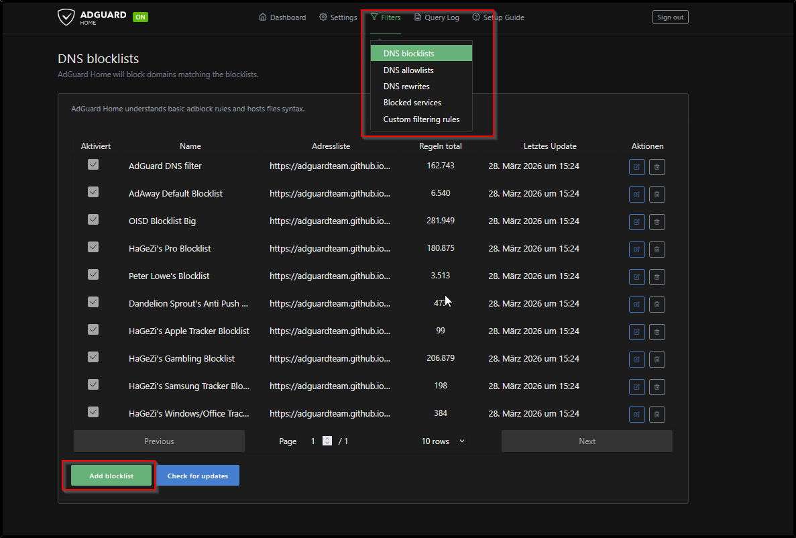
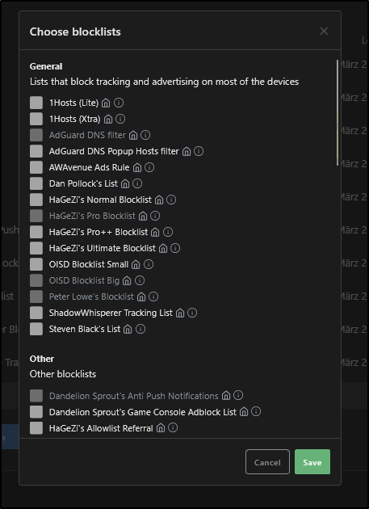
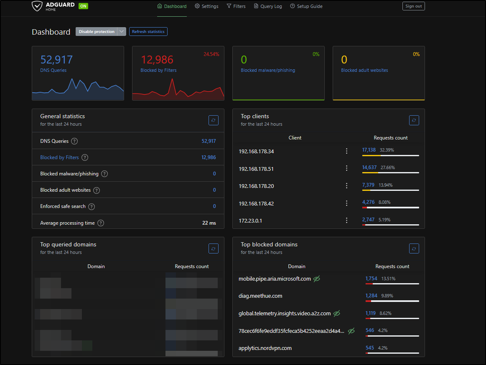

# Your Smart Home Is Snitching On You: DNS Telemetry Blocking with AdGuard Home

## The Problem Nobody Talks About

You buy a Philips Hue bulb. A *lightbulb*. You screw it in, connect it to the app, and think nothing of it.

What you don't see: every 2 minutes, that lightbulb sends a DNS request to `diag.meethue.com`. Not when you turn it on. Not when something breaks. Every. Two. Minutes. Around the clock.



That's one PC, one Echo, one iPhone, and one lamp in six minutes. This is the floor, not the ceiling. AdGuard only sees DNS requests. Apps that hardcode IPs or use HTTPS certificate pinning bypass this entirely and you'd never know.

The good news: blocking at DNS level is the most efficient way to handle this. One device, whole network covered.

---

## How DNS Blocking Works

When any device on your network wants to reach `diag.meethue.com`, it first asks a DNS resolver: *"What's the IP for this domain?"*

Normally your router forwards that to your ISP's DNS server, which returns an IP, and the connection goes through.

AdGuard sits between your devices and the internet as a **local DNS resolver**. When a request matches a blocklist entry, AdGuard returns nothing (or `0.0.0.0`) instead of a real IP. The device gets no address, the connection never happens.

```
Normal:   Device -> Router -> ISP DNS -> Real IP -> Connection ✓
Blocked:  Device -> AdGuard -> 0.0.0.0 -> Connection ✗
```

No IP, no connection. Simple and effective.

---

## Setup: AdGuard on Raspberry Pi

I run AdGuard Home on a Raspberry Pi as part of my home server stack. The full setup lives in a Docker Compose file:

```yaml
services:
  adguard:
    image: adguard/adguardhome:latest
    container_name: adguard
    restart: unless-stopped
    ports:
      - 53:53/tcp
      - 53:53/udp
      - 3001:3000/tcp
      - 8889:80/tcp
    volumes:
      - adguard_work:/opt/adguardhome/work
      - adguard_conf:/opt/adguardhome/conf
```

**After `docker compose up -d`:**

1. Open `http://<raspi-ip>:3000` for initial setup
2. Set DNS listen port to `53`
3. Set admin interface to whatever port you want (I use `8889`)
4. Point your router's DNS server to the Raspberry Pi IP

That last step is key. Every device on the network automatically uses AdGuard, no per-device configuration needed.

### Fritz!Box: Setting the DNS Server

If you're running a Fritz!Box, the setting is slightly buried:

1. Open `http://fritz.box`
2. **Home Network -> Network -> Network Settings -> Advanced Network Settings -> IPv4 Settings**
3. Set **Local DNS Server** to your Raspberry Pi IP (e.g. `192.168.178.85`)





Save and done. Every device that gets its IP via DHCP from the Fritz!Box will now use AdGuard as its DNS resolver automatically, no configuration needed on individual devices.

---

## Filterlists: Which Ones and Why

AdGuard ships with its own list, but the real power comes from community lists. Here are the most important ones I run:

| List | Blocks |
|------|--------|
| **AdGuard DNS filter** | Ads, trackers, general purpose |
| **OISD Blocklist Big** | Large general blocklist, low false positives |
| **HaGeZi's Pro Blocklist** | Aggressive tracking and telemetry |
| **HaGeZi's Windows/Office Tracker Blocklist** | Microsoft-specific telemetry |
| **HaGeZi's Apple Tracker Blocklist** | Apple-specific telemetry |

**Why HaGeZi specifically?** It's actively maintained, has separate lists per vendor so you can tune aggressiveness, and explicitly targets telemetry, not just ads.

Add lists under **Filters -> DNS Blocklists -> Add blocklist -> Add a custom list**.





HaGeZi lists: `https://github.com/hagezi/dns-blocklists`

---

## Local DNS: Custom Domains for Home Services

A bonus feature: AdGuard doubles as a local DNS server. Instead of remembering `192.168.178.85:8096` for Jellyfin, you can set up DNS rewrites:

```
AdGuard.lan  -> 192.168.178.85
```

Now `http://jellyfin.lan` works from any device on the network. The `.lan` TLD is local-only, no external DNS ever sees it.

Set up under **Filters -> DNS Rewrites**.

> **Note:** If you use Nginx Proxy Manager or another reverse proxy, point all `.lan` rewrites at the proxy's IP, not the service directly. The proxy handles routing from there.

---

## What Still Gets Through

DNS blocking is not a complete solution. Several things bypass it:

**1. Hardcoded IPs**
If an app skips DNS entirely and connects directly to `216.58.213.14` instead of `google.com`, AdGuard never sees it. Some IoT firmware does this deliberately.

**2. HTTPS/Certificate Pinning**
Apps that pin their TLS certificates can't be intercepted by a local proxy. You can block the domain, but if they fall back to a hardcoded IP you're blind.

**3. DNS over HTTPS (DoH) / DNS over TLS (DoT)**
Some devices (newer Android, Firefox) use encrypted DNS by default, bypassing your local resolver completely. Solution: block known DoH providers at the firewall level, or configure AdGuard as the upstream DoH server.

**4. IPv6**
If you block `example.com` for IPv4 (A records) but forget the AAAA record, IPv6-capable devices connect anyway. AdGuard handles both by default as long as IPv6 isn't disabled on your Pi.

**The bottom line:** What AdGuard shows you in the query log is the *minimum* amount of telemetry leaving your network, not the total.

---

## Results

After running this setup for a week, a few things stand out:



- The Amazon Echo is by far the most aggressive device on the network. Multiple unique hash-based subdomains under `minerva.devices.a2z.com` get blocked every few minutes, even at 3am.
- NordVPN, ironically a privacy tool, sends telemetry to `applytics.nordvpn.com` regularly.
- Mozilla Firefox phones home to `incoming.telemetry.mozilla.org` and `ads.mozilla.org` despite having telemetry "disabled" in settings.
- The Philips Hue Bridge contacts `diag.meethue.com` on a precise ~2 minute interval. Clockwork.

None of this requires you to "do" anything. It happens in the background, on every device, all the time.

---

## Takeaways

- DNS-level blocking is low effort, high reward. One setup covers every device.
- HaGeZi lists are worth adding on top of the defaults.
- AdGuard's query log is a surprisingly useful visibility tool.
- Don't trust "telemetry disabled" toggles in apps. Verify at the network level.
- DNS blocking has real limits. It's one layer, not a complete solution.

---
