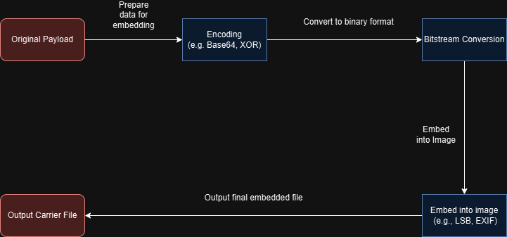
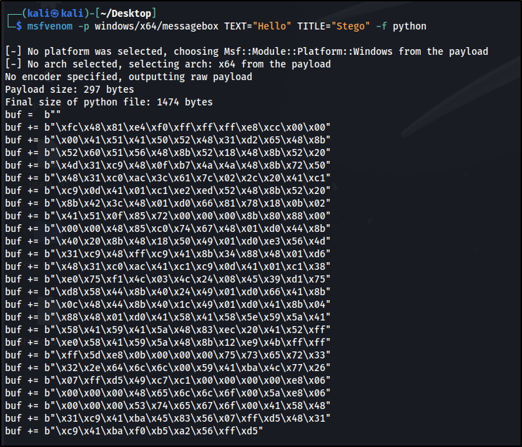

# **From Pixels to Payload**

---
### 🎯 **Goal**

This is a personal learning project where I set out to explore how binary payloads can be stealthily hidden inside image files and executed entirely from memory without writing anything obvious to disk or leaving behind a large forensic footprint.

The main idea was to combine **steganography** with **in-memory execution**, eventually building a custom DLL that can act as a stealth loader using **DLL hijacking**. The endgame? Code execution inside a trusted process, no UAC prompts, no file drops or at least that's the theory.

To start, I built out a Python prototype to test:

- **LSB steganography** to embed payloads into PNGs

- **Base64** encoding/decoding for cleaner transport

- **In-memory shellcode execution** using `ctypes` (just for testing)


Right now, both the embedding and extraction logic live in Python, but the plan is to eventually **rebuild the extractor in C++** to integrate it with a real DLL hijack scenario.

Even if some parts don’t fully hit the stealth or reliability I want, that’s fine  the goal is to learn by building, testing, and breaking stuff. It’s about understanding the trade-offs, not chasing a perfect PoC.

---
###  🧊 LSB Steganography What & Why?

**LSB (Least Significant Bit) steganography** is one of the simplest ways to hide data in images.

Each pixel in a standard RGB image holds 3 bytes one for red, green, and blue. By flipping just the **last bit** of one of these values, you can hide binary data without making visible changes to the image.

`Original Red:   10110010 → 178   Modified Red:   10110011 → 179`  

That’s only a 1-point change in value, which the human eye won’t notice  but it’s enough to store a single bit. Do this across thousands of pixels and you can stash a full payload in plain sight.

I stuck with the **lowest bit in the red channel only** for simplicity and minimal visual noise. You can push it further (2–3 bits per channel), but I wanted to keep it subtle.

---
### 💡 Why LSB + Memory Execution?

I wanted to test whether it’s possible to **hide a payload inside an image** and then execute it without ever writing anything to disk. That’s where **LSB steganography** and **in-memory execution** come in.

- LSB lets me embed data inside an image without changing how it looks.
- In-memory execution avoids writing an EXE or DLL to disk – the payload runs directly from memory.

This combo sounded interesting, so I set out to see **if it would actually work in practice**, starting with simple payloads and expanding from there.


---
### 📦 Components

- `embed.py` → Encodes a shellcode or any binary payload into the LSBs of a PNG image
    
- `extract.py` → Recovers the payload, decodes it, and executes it in memory

---
### ⚙️ Technical Workflow

**Embedding Phase**  

**Extraction Phase**  


---
### 🔐 Tested Payloads

I used `msfvenom` to generate a simple 64-bit Windows MessageBox payload for testing:

``` bash
msfvenom -p windows/x64/messagebox TEXT="Hello" TITLE="Stego" -f python
```



---
### 🧪 Output Example

Here’s what it looks like after encoding:

```bash
Text embedded.
Encoded base64 payload: /EiB5PD////ozAAAAEFRQVBSSDHSZUiLU........
Byte length: 396
```

Then, after extraction:

```bash
[+] Extracted (Base64): b'/EiB5PD////ozAAAAEFRQVBSSDHSZUiLUmBRVkiLUhhIi1IgTTHJSA.......'
[+] Decoded Payload: b'\xfcH\x81\xe4\xf0\xff\xff\xff\xe8\xcc\x00\x00\x00AQAPRH1\xd2eH\x8bR`QVH\x8bR\x18H\x8bR M1\xc9H\x0f\xb7JJH\x8brPH1\xc0\xac<a|\x02, A\xc1\xc9\rA\x01\xc1\xe2\xedRH\x8bR \x8bB<H\x01\xd0f\x81x\x18\x0b\x02AQ\x0f\x85r\x00\x00\x00\x8b\x80\x88\...........'
[DEBUG] Allocated pointer: 0x21ff5500000
```

Executing the extractor pops our messagebox.

![[messagebox.png]]


---
### 💻 C++ Rebuild & Shellcode Execution

While I had some basic experience with game hacking, which gave me a foundation in memory allocation and raw pointer manipulation, byte-level data, and bitwise operations in C++ was new territory for me.

To deepen my understanding, I decided to rewrite my Python extractor in C++. This gave me hands-on experience with several key concepts:

- **Reading raw PNG pixel data** using the `lodepng` library
    
- **Extracting and converting bitstreams** into usable bytes
    
- **Validating custom STEG markers and length headers** for embedded data
    
- **Implementing manual Base64 decoding** routines
    
- **Executing in-memory shellcode** via `VirtualAlloc`, `memcpy`, and function pointers
    

Rebuilding everything in C++ forced me to think more deeply about how low-level execution works much more than Python ever did. Debugging the process taught me to account for edge cases I hadn’t considered before, like payload length mismatches and memory alignment issues.

This exercise significantly leveled up my understanding of binary data handling and executable memory operations in a real-world context.

---
### 🔗 POC Repository

You can find the full code, for the Python POC here:  
[**📂github.com/Yuriibe/poc_stegano_loader**](https://github.com/Yuriibe/poc_stegano_loader)

And for the C++ Extractor here:
[**📂github.com/Yuriibe/StegaExtractor**](https://github.com/Yuriibe/StegaExtractor)

---
### 🚧 What’s Next: Part 2 – DLL Search Order Hijacking

The next phase of this project will explore **DLL Search Order Hijacking** as a stealthier method of payload delivery. The plan is to:

- Refactor the current **C++ extractor into a DLL**
    
- Implement an exported function that automatically extracts and executes the hidden payload when the DLL is loaded
    
- Use **DLL hijacking** techniques to place the malicious DLL in a location where a vulnerable application will load it instead of the legitimate one
    

This will allow me to test in-memory execution in a real-world process context—without dropping any obvious executables to disk, and without triggering UAC prompts. Part 2 will focus on **loading the payload as part of a trusted process**.

---
## 📩 Contact

Open to work in threat research, SOC, detection engineering, reverse engineering, or red teaming.