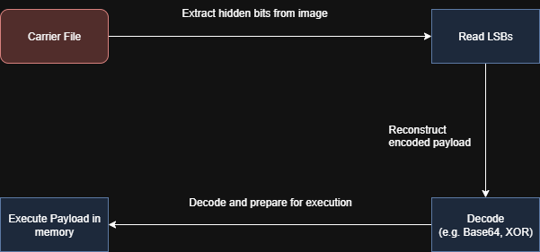

# **From Pixels to Payload**

---
### 🎯 **Goal**

This writeup documents a personal learning experiment aimed at understanding how binary payloads can be stealthily embedded in images and executed entirely in memory with minimal forensic footprint.

The core idea is to **explore the combination of steganography and in-memory execution**, with the long-term goal of building a custom DLL that acts as a stealthy payload loader via **DLL hijacking**. This would allow code execution inside a trusted process without dropping files or triggering UAC. Or atleast thats the plan 

To begin, I prototyped the payload embedding stage in Python to experiment with:

- **LSB steganography** for hiding payloads in PNG images
    
- **Base64 encoding / decoding** as a flexible wrapper
    
- **In-memory shellcode execution** using Python’s `ctypes` (for testing purposes)

Although the extractor and runtime code are currently implemented in Python, the ultimate goal is to **rebuild that part in C++**, both for performance and for integration into a real DLL hijacking scenario.

This project is ongoing and even if some parts don't fully achieve the intended stealth or reliability, the process of testing, analyzing, and improving is the actual objective.  
It's as much about **understanding trade-offs** and limitations as it is about reaching a "perfect" PoC.

---
### 📦 Components

- `embed.py` → Encodes a shellcode or any binary payload into the LSBs of a PNG image
    
- `extract.py` → Recovers the payload, decodes it, and executes it in memory

---
### ⚙️ Technical Workflow

**Embedding Phase**  

**Extraction Phase**  


---
💡 Why LSB + Memory Execution?

I wanted to test whether it’s possible to **hide a payload inside an image** and then execute it without ever writing anything to disk. That’s where **LSB steganography** and **in-memory execution** come in.

- LSB lets me embed data inside an image without changing how it looks.
- In-memory execution avoids writing an EXE or DLL to disk – the payload runs directly from memory.

This combo sounded interesting, so I set out to see **if it would actually work in practice**, starting with simple payloads and expanding from there.

---
🔐 Tested Payloads
``` bash
msfvenom -p windows/x64/messagebox TEXT="Hello" TITLE="Stego" -f python
```


---
🧪 Output Example

```bash
Text embedded.
Encoded base64 payload: /EiB5PD////ozAAAAEFRQVBSSDHSZUiLU........
Byte length: 396
```

```bash
[+] Extracted (Base64): b'/EiB5PD////ozAAAAEFRQVBSSDHSZUiLUmBRVkiLUhhIi1IgTTHJSA.......'
[+] Decoded Payload: b'\xfcH\x81\xe4\xf0\xff\xff\xff\xe8\xcc\x00\x00\x00AQAPRH1\xd2eH\x8bR`QVH\x8bR\x18H\x8bR M1\xc9H\x0f\xb7JJH\x8brPH1\xc0\xac<a|\x02, A\xc1\xc9\rA\x01\xc1\xe2\xedRH\x8bR \x8bB<H\x01\xd0f\x81x\x18\x0b\x02AQ\x0f\x85r\x00\x00\x00\x8b\x80\x88\...........'
[DEBUG] Allocated pointer: 0x21ff5500000
```

---
### 🔗 POC Repository

You can find the full code, for this POC here:  
[**📂 github.com/Yuriibe/poc_stegano_loader**](https://github.com/Yuriibe/poc_stegano_loader)